# ai-agent-skills

实用的 AI Agent Skills 集合 —— 面向本地 / 离线场景，全部为作者日常使用、实测验证过的自制技能。

A collection of practical, battle-tested AI agent skills for local/offline scenarios. No cloud fees, no data leakage.

## 目录 / Contents

| Skill | 用途 / What it does | 依赖 / Dependencies |
|---|---|---|
| [lino-local-vision](lino-local-vision/README.md) | 给 DeepSeek 等文本模型补上"眼睛"：LM Studio 跑 Qwen3-VL 本地视觉，离线看图 / OCR，无需 API key | LM Studio + Python 3.9+ + Pillow |
| [lino-veusz-sci-plot](lino-veusz-sci-plot/README.md) | 用开源 Veusz 自动化画出版级科学图，覆盖 16 种图型（含 3D / 极坐标 / 三元图） | Veusz 4.x |

## 这是什么 / What are Agent Skills?

Agent Skills 是给 AI Agent（如 Claude Code、Reasonix 等）使用的可复用"操作手册"（playbook）：
一个 skill 目录里包含一份 `SKILL.md`（告诉 agent 怎么用）和若干辅助脚本。
Agent 在接到相关任务时会自动读取并按照 skill 执行，让复杂操作（画图、看图、OCR）变成一条命令。

- **lino-local-vision**：DeepSeek 没有多模态？Reasonix 接 DeepSeek API 也不能识图？用它给文本模型补上"眼睛"——图片完全在本机推理，不上传任何数据，免费、离线、无 key。
- **lino-veusz-sci-plot**：用开源软件 Veusz（Origin 的开源替代品）批量出图，脚本可复现、可批量导出 PNG/PDF。

## 安装 / Installation

把 skill 目录复制（或软链接）到你的 agent 的 skills 目录即可，例如：

```powershell
# 以 Claude Code / Reasonix 为例（路径因工具而异）
Copy-Item lino-local-vision C:\Users\you\.agents\skills\lino-local-vision -Recurse
Copy-Item lino-veusz-sci-plot  C:\Users\you\.agents\skills\lino-veusz-sci-plot  -Recurse
```

## 快速开始 / Quick Start

**lino-local-vision**（先启动 LM Studio 并加载视觉模型，详见其 README）：

```powershell
python lino-local-vision/scripts/analyze.py --image demo.png --prompt "用一句话描述这张图片的内容"
```

**lino-veusz-sci-plot**（`<veusz-exe>` 替换为你的 Veusz 可执行文件路径）：

```powershell
<veusz-exe> --export out.png lino-veusz-sci-plot/examples/bar.py
```

## 示例图 / Examples

`lino-veusz-sci-plot/examples/` 内含 **15 种科研图型的完整脚本 + 输出 PNG**，拿过来改数据就能用：

| | | | | |
|---|---|---|---|---|
| 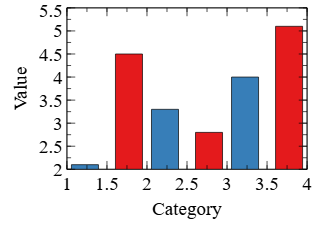 | 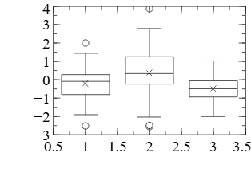 | 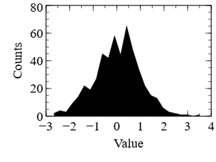 | 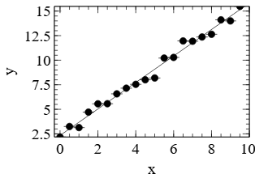 | 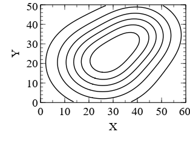 |
| 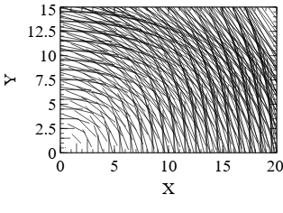 | 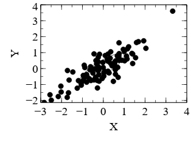 | 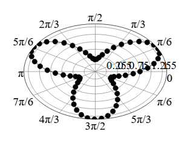 | 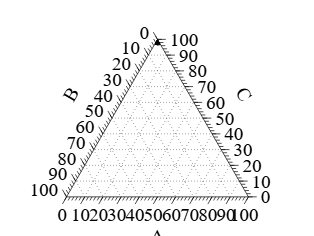 | 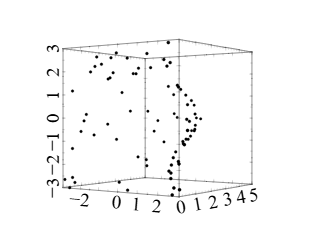 |
| 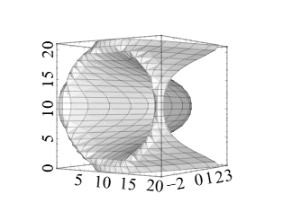 | 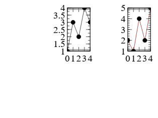 | 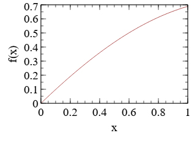 | 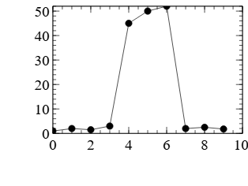 | 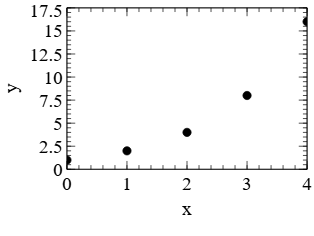 |

柱状 (`bar`) · 箱线 (`boxplot`) · 直方图 (`histo`) · 拟合 (`fit`) · 等高线 (`contour`) · 矢量场 (`vectorfield`) · 误差椭圆 (`covariance`) · 极坐标 (`polar`) · 三元图 (`ternary`) · 3D 散点 (`point3d`) · 3D 曲面 (`surface3d`) · 多面板 (`grid`) · 函数曲线 (`function`) · 断裂轴 (`axisbroken`) · 标注/形状 (`label_shape`)

## 视频教程 / Video Tutorials

- [DeepSeek V4 Flash 刚发布，但还不能识图！用 Reasonix + LM Studio 本地跑 Qwen3-VL，免费离线](https://www.bilibili.com/video/BV1jT3R6jEZk/) — `lino-local-vision` 中文教学（B站）

## 许可 / License

MIT © 2026 LINoone516
